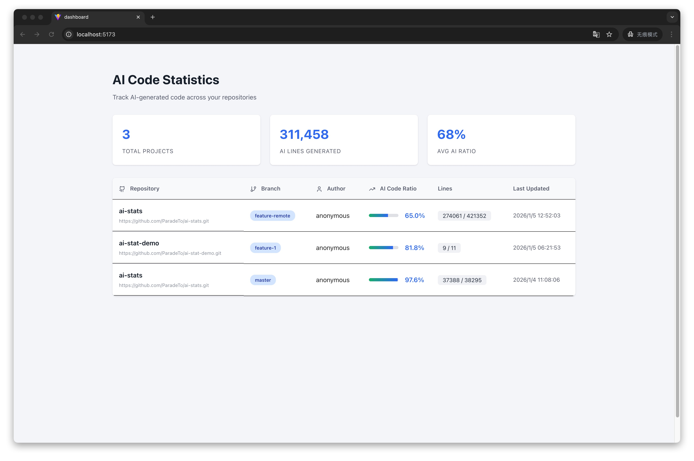
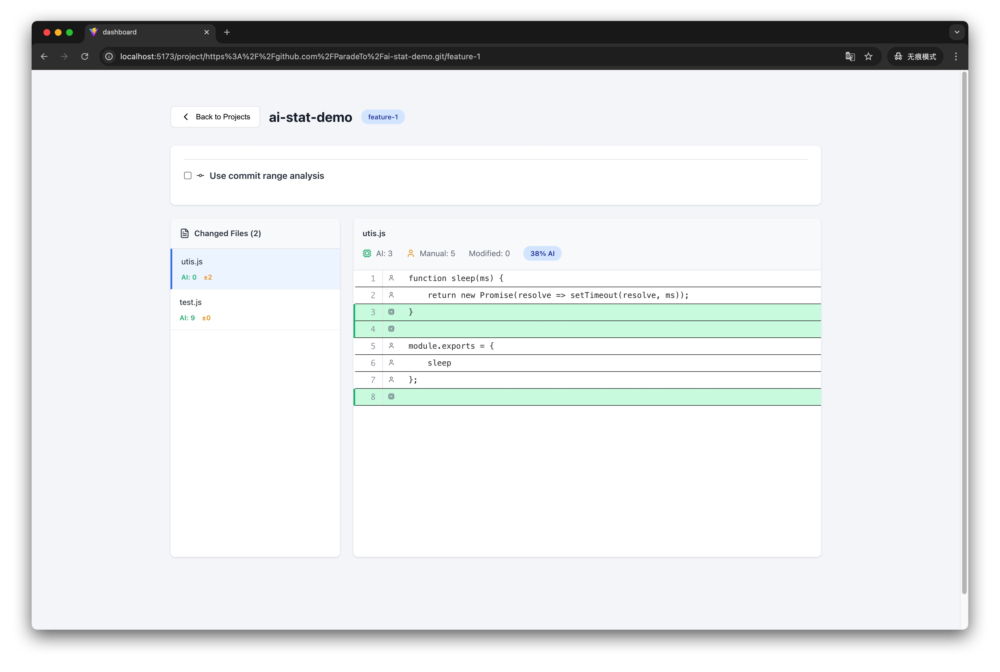
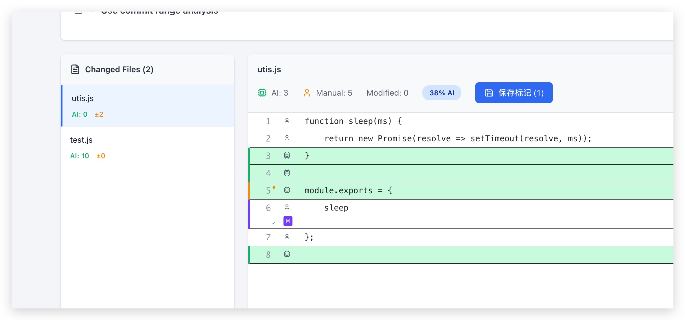
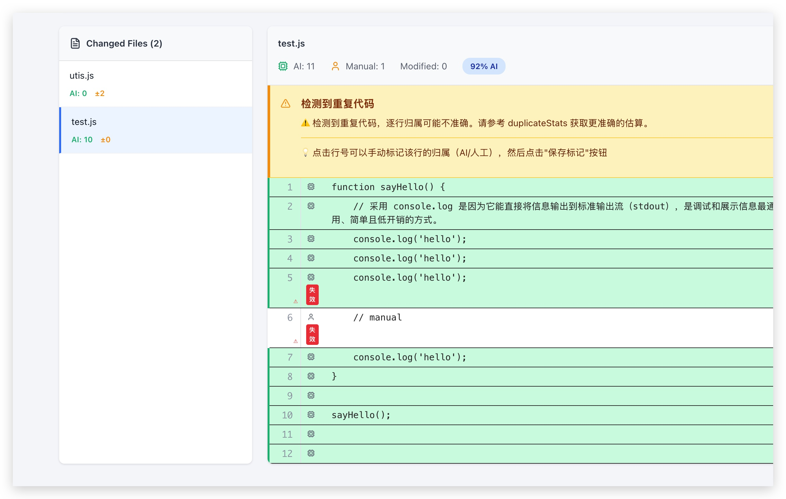
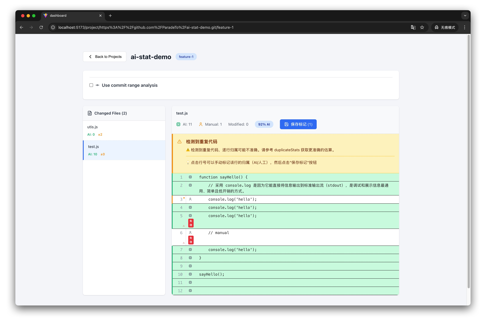
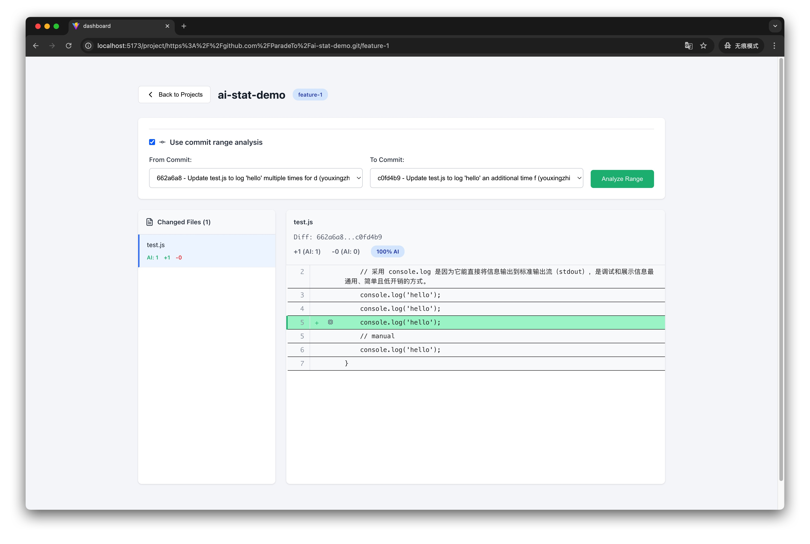

# AI 代码追踪系统

追踪和分析仓库中 AI 代码的占比。详细的系统介绍见 [系统介绍文档](./doc/SYSTEM-INTRODUCTION.md)。

## 快速开始

### 1. 安装与启动

**安装 Cursor 插件**：

克隆本项目后，在 Cursor 编辑器中打开插件目录并安装，插件会自动配置钩子以捕获 AI 生成的代码。

**安装依赖**：

系统分为后端和前端两个部分，需要分别安装依赖：

```bash
# 后端服务
cd server
pnpm install

# 前端面板
cd dashboard
pnpm install
```

**配置环境变量**：

在 `server` 目录下创建 `.env` 文件，配置 GitHub 访问令牌：

```bash
GITHUB_TOKEN=your_github_token_here
```

**启动服务**：

```bash
# 启动后端服务（端口 3001）
cd server
pnpm start

# 启动前端面板（端口 3000）
cd dashboard
pnpm start
```

启动成功后，访问 `http://localhost:3000` 即可看到系统主界面。


### 2. 基本使用流程

#### 步骤 1：使用 AI 生成代码并推送到 GitHub

在 Cursor 编辑器中使用 AI 生成代码。系统会自动捕获这次 AI 生成的差异并存入数据库。完成开发后，将代码提交并推送到 GitHub。

> **重要提示**：只有在代码推送到 GitHub 后，系统才能在项目列表页展示该仓库的分析数据。

#### 步骤 2：查看列表

代码推送到 GitHub 后，打开系统主界面，即可以看到分析的数据：



#### 步骤 3：查看详情

点击项目，进入详情页面：



**查看代码归属**：

点击左侧的文件，系统会展示文件内容，每一行代码都标注了归属：
- 绿色背景：AI 生成
- 白色背景：人工编写
- 橙色左边框 + ● 标记：有未保存的手动标记
- 紫色左边框 + ✓ 标记：已保存的手动标记
- ⚠ 标记：手动标记已失效（内容已变更）



**处理重复代码警告**：

如果文件中存在多行相同的代码，系统会在顶部显示警告信息：



#### 步骤 4：手动标记

对于系统无法准确判断的代码（如重复代码），可以手动标记。点击代码行号，该行的归属会在 AI/人工之间切换，点击页面顶部的"保存手动标记"按钮。



手动标记会存储在数据库中，并在后续所有分析中优先使用。

#### 步骤 5：Commit 范围分析

如果需要分析特定 commit 范围内的代码变更，可以：

1. 勾选"使用 commit 范围分析"
2. 输入起始 commit 和结束 commit 的哈希值
3. 点击"分析"

系统会展示该范围内的所有变更，并标注每一行的增删状态和 AI 归属。


