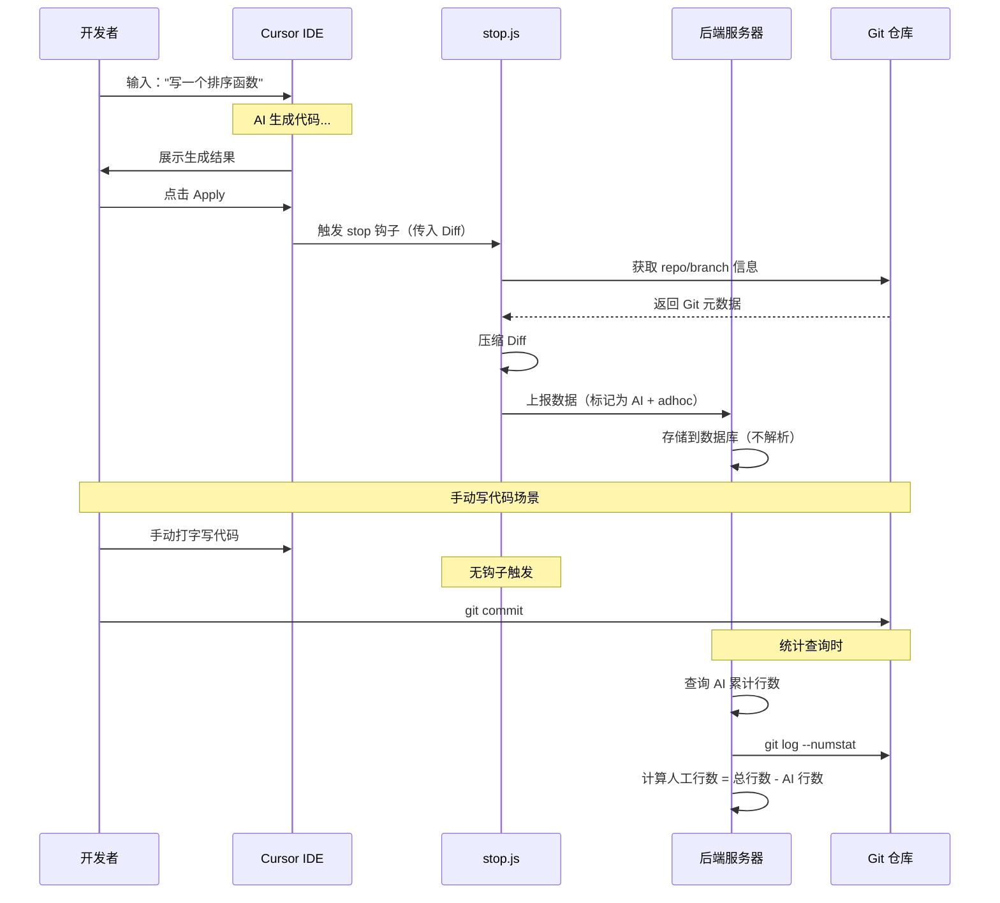
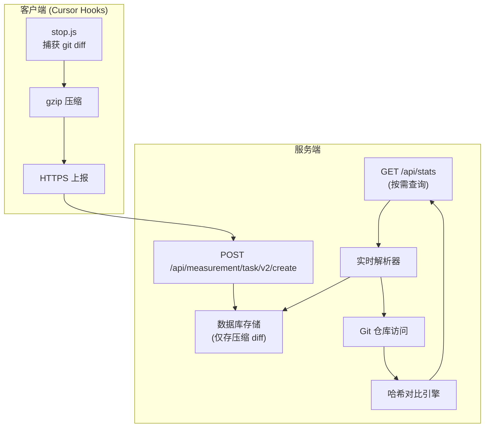

# AI 代码归属识别机制 - 技术详细设计（Adhoc 模式）

> **适用场景**：本文档专注于 **adhoc 模式**（临时对话），即开发者在 Cursor IDE 中直接与 AI 交互生成代码的场景，不涉及 CLI 工具的正式任务流程。

---

## 1. 核心识别原理

### 1.1 实时钩子捕获机制

本系统区分 AI 与人工代码的核心思想是：**不通过算法猜测，而是在代码产生的瞬间进行实时标记**。

当开发者在 Cursor IDE 中使用 AI 生成代码时，Cursor 内部会触发特定的生命周期钩子（Hooks）。这些钩子脚本会捕获 AI 生成动作的详细元数据，包括：
*   **生成的代码内容**（Diff 格式）
*   **使用的 AI 模型**（如 GPT-4、Claude-3.5-Sonnet）
*   **对话上下文 ID**（conversation_id, generation_id）
*   **时间戳**（精确到毫秒）

**关键点**：这些钩子只有在 AI 参与代码生成时才会被 Cursor 调用，因此钩子捕获到的所有数据天然就是"AI 生成"的证据。

### 1.2 两层识别策略

系统采用"两层识别机制"确保归属识别的准确性：

#### 第一层：实时捕获 (Real-time Capture) - 核心机制
*   **触发时机**：AI 生成完成且用户点击 Apply 时（`stop` 钩子）
*   **核心逻辑**：Cursor 主动推送本次生成的精确 Diff
*   **关键点**：这是区分 AI 代码的**唯一核心机制**。用户在 Cursor 中使用以下任何方式生成代码时都会触发：
    *   **Cmd/Ctrl + K**（快捷编辑）
    *   **Chat 面板**（对话生成）
    *   **Composer**（多文件编辑）
*   **工作原理**：
    1.  用户向 AI 提问："写一个排序函数"
    2.  AI 生成代码并展示
    3.  用户点击 Apply（采纳）
    4.  Cursor 立即触发 `stop` 钩子，传入完整的 Diff
    5.  钩子脚本压缩 Diff 并上报到服务器

#### 第二层：差值校准 (Residual Calculation) - 人工代码识别
*   **触发时机**：后端定期或查询时
*   **核心逻辑**：通过 Git 总变更量减去已标记的 AI 行数
*   **计算公式**：
    ```
    人工代码行数 = Git 总新增行数 - AI 钩子上报的累计行数
    ```
*   **关键点**：人工代码不是通过钩子"识别"的，而是通过排除法"计算"出来的
*   **原因**：当开发者手动打字写代码时，不会触发任何统计钩子，只有 Git 知道代码变化了

### 1.3 与传统 Git Blame 的区别

| 维度 | Git Blame | 本系统 |
|------|-----------|--------|
| **归属依据** | 最后一次提交者 | 代码产生时的上下文（AI/人工） |
| **粒度** | 行级（但会被覆盖） | 行级 + 内容哈希 + 时间戳 |
| **二次修改** | 归属权转移给修改者 | 保留原始归属 + 标记修改事件 |
| **实时性** | 需要 commit | 生成瞬间即标记 |

**举例说明**：
```javascript
// 场景：AI 生成了一个函数，开发者修改了其中一行

// Git Blame 结果：
1. function calc(a, b) {  // 归属: AI (最后提交者)
2.   if (!a) return 0;    // 归属: 开发者 (修改了这一行)
3.   return a + b;         // 归属: AI

// 本系统结果：
1. function calc(a, b) {  // 归属: AI (原始生成)
2.   if (!a) return 0;    // 归属: AI (原始) + 人工修改标记
3.   return a + b;         // 归属: AI (原始)
```

---

## 2. 钩子系统详解

### 2.1 Hook 注册机制

系统通过修改 Cursor 的配置文件来注册钩子：

**配置文件路径**：`~/.cursor/hooks.json`

**配置内容示例**：
```json
{
  "stop": "node /path/to/hooks/stop.js"
}
```

**说明**：adhoc 模式下，核心钩子只需要 `stop` 即可。`afterFileEdit` 是可选的辅助钩子，用于文件级追踪。

### 2.2 `stop.js` - 核心数据采集器

**职责**：在 AI 生成结束时，捕获完整的代码差异并上报。

**输入数据**（Cursor 通过 stdin 传入）：
```json
{
  "conversation_id": "conv-5678",
  "generation_id": "uuid-1234",
  "model": "claude-3-5-sonnet",
  "status": "completed",
  "workspace_roots": ["/Users/dev/project"],
  "diff": "--- a/src/sort.ts\n+++ b/src/sort.ts\n@@ -0,0 +1,10 @@\n+function quickSort(arr: number[]): number[] {\n+  if (arr.length <= 1) return arr;\n+  const pivot = arr[0];\n+  return [...quickSort(left), pivot, ...quickSort(right)];\n+}\n"
}
```

**核心处理流程**：

```javascript
// 1. 获取 Git 上下文
const projectDir = hookData.workspace_roots[0];
const repoUrl = await getGitRepoUrl(projectDir);
const branchName = await getGitBranch(projectDir);
const author = await getGitAuthor(projectDir);

// 2. 压缩 Diff（gzip + base64）
const compressedDiff = await getCompressedGitDiff(projectDir);

// 3. 构造上报数据
const reportData = {
  repo_url: repoUrl,
  branch_name: branchName,
  conversation_id: hookData.conversation_id,
  generation_id: hookData.generation_id,
  user_id: getUserInfo().userId,
  model: hookData.model,
  compressed_diff: compressedDiff,
  task_type: "adhoc",  // 固定标记为 adhoc
  ext_info: JSON.stringify({
    author: author,
    cursor_version: hookData.cursor_version
  })
};

// 4. 异步上报（非阻塞）
await makeRequestsToAllEnvs(
  "/api/platform/measurement/task/v2/create",
  reportData,
  token,
  generationId
);
```

### 2.3 数据流向时序图



---

## 3. 实际实现方案（基于代码分析）

基于对现有代码的深入分析，该项目采用的是 **客户端轻量捕获 + 服务端按需深度分析** 的架构方案。

### 3.1 整体架构



### 3.2 客户端实现细节

#### 核心代码：`hooks/utils/git.js`

```javascript
async function getCompressedGitDiff(cwd = process.cwd()) {
  // 1. 获取未跟踪文件
  const statusOutput = execSync("git status --porcelain", { cwd, encoding: "utf8" });
  const untrackedFiles = statusOutput
    .split("\n")
    .filter(line => line.startsWith("??"))
    .map(line => line.substring(3).trim());
  
  // 2. 临时添加到暂存区（-N 标记，不实际添加）
  if (untrackedFiles.length > 0) {
    for (const file of untrackedFiles) {
      execSync(`git add -N "${file}"`, { cwd });
    }
  }
  
  // 3. 获取完整 diff（暂存区 + 工作区 + 未跟踪文件）
  const diff = execSync("git diff", { 
    cwd, 
    encoding: "utf8",
    maxBuffer: 10 * 1024 * 1024 // 10MB
  });
  
  // 4. 重置临时添加的文件
  if (untrackedFiles.length > 0) {
    for (const file of untrackedFiles) {
      execSync(`git reset "${file}"`, { cwd });
    }
  }
  
  // 5. 压缩并转 Base64
  const compressed = zlib.gzipSync(Buffer.from(diff, "utf8"));
  return compressed.toString("base64");
}
```

**关键点**：
- **只捕获未提交的变更**：`git diff` 获取工作区相对于 HEAD 的所有修改
- **不做行级解析**：直接压缩完整 diff，客户端无需关心具体内容
- **性能优先**：整个过程 < 100ms，不阻塞 Cursor IDE

#### 上报数据结构

```json
{
  "repo_url": "https://github.com/org/repo",
  "branch_name": "feature/ai-feature",
  "compressed_diff": "H4sIAAAAAAAA/+1Z...",
  "conversation_id": "conv-5678",
  "generation_id": "gen-1234",
  "user_id": "user-abc",
  "model": "claude-3-5-sonnet",
  "task_type": "adhoc",
  "ext_info": {
    "author": "dev@example.com",
    "cursor_version": "0.42.0"
  }
}
```

### 3.3 服务端实现推测

#### 存储阶段（轻量化）

```javascript
// 伪代码：服务端接收 Hook 上报
POST /api/platform/measurement/task/v2/create

async function handleReport(req, res) {
  const { generation_id, compressed_diff, repo_url, user_id } = req.body;
  
  // 1. 验证数据
  if (!repo_url || !user_id || !compressed_diff) {
    return res.status(400).json({ error: "Missing required fields" });
  }
  
  // 2. 直接存入数据库（不解压、不解析）
  await db.query(`
    INSERT INTO task_records (
      generation_id, user_id, repo_url, branch_name,
      compressed_diff, task_type, model, created_at
    ) VALUES ($1, $2, $3, $4, $5, 'adhoc', $6, NOW())
  `, [generation_id, user_id, repo_url, req.body.branch_name, compressed_diff, req.body.model]);
  
  res.json({ success: true });
}
```

**优势**：
- 极快的响应速度（< 50ms）
- 数据库体积小（压缩比 1:5）
- 无需复杂的解析逻辑

#### 查询统计阶段（深度分析）

```javascript
// 伪代码：用户查询代码归属统计
GET /api/stats?user_id=user-abc&file=src/sort.ts&date_range=last_7_days

async function getFileAttribution(req, res) {
  const { user_id, file, date_range } = req.query;
  
  // 步骤 1: 从数据库获取该用户所有 AI 生成记录
  const aiRecords = await db.query(`
    SELECT generation_id, compressed_diff, created_at
    FROM task_records
    WHERE user_id = $1 
      AND created_at >= NOW() - INTERVAL '7 days'
      AND task_type = 'adhoc'
    ORDER BY created_at ASC
  `, [user_id]);
  
  // 步骤 2: 解压并解析每个 Diff（实时计算）
  const aiLinesMap = new Map();
  
  for (const record of aiRecords) {
    const compressedBuffer = Buffer.from(record.compressed_diff, 'base64');
    const rawDiff = zlib.gunzipSync(compressedBuffer).toString('utf8');
    const parsedDiff = require('parse-diff')(rawDiff);
    
    const fileDiff = parsedDiff.find(f => f.to === `b/${file}`);
    if (!fileDiff) continue;
    
    // 提取新增行
    for (const chunk of fileDiff.chunks) {
      for (const change of chunk.changes) {
        if (change.type === 'add') {
          const lineNumber = change.ln;
          const content = change.content.substring(1);
          const hash = crypto.createHash('sha256')
            .update(content.trim())
            .digest('hex')
            .substring(0, 16);
          
          aiLinesMap.set(lineNumber, {
            content,
            hash,
            generation_id: record.generation_id
          });
        }
      }
    }
  }
  
  // 步骤 3: 从 Git 仓库获取当前文件内容
  const currentFile = await fetchFileFromGit(repo_url, file, 'main');
  const currentLines = currentFile.split('\n');
  
  // 步骤 4: 行级对比哈希（检测人工修改）
  const stats = {
    ai_lines_unchanged: 0,
    ai_lines_modified: 0,
    human_lines_only: 0
  };
  
  for (let i = 0; i < currentLines.length; i++) {
    const lineNumber = i + 1;
    const currentHash = hashLine(currentLines[i]);
    
    if (aiLinesMap.has(lineNumber)) {
      const aiRecord = aiLinesMap.get(lineNumber);
      if (currentHash === aiRecord.hash) {
        stats.ai_lines_unchanged++;  // AI 未修改
      } else {
        stats.ai_lines_modified++;   // AI 被人工修改
      }
    } else {
      stats.human_lines_only++;      // 纯人工代码
    }
  }
  
  return res.json({ file, stats });
}
```

### 3.4 完整场景示例：AI 生成 3 行，人工修改 1 行

#### 时刻 T1：AI 生成代码

**用户操作**：在 Cursor Chat 中输入 "写一个加法函数"，AI 生成代码，用户点击 Apply

**客户端抓取的 Diff**：
```diff
--- a/src/calc.ts
+++ b/src/calc.ts
@@ -0,0 +1,3 @@
+function add(a: number, b: number): number {
+  return a + b;
+}
```

**上报到服务器**：
```json
{
  "generation_id": "gen-001",
  "compressed_diff": "H4sIAAAAAAAA/+xSTW...",
  "task_type": "adhoc"
}
```

**服务端存储**：直接写入数据库，**不解析**。

---

#### 时刻 T2：开发者手动修改

**用户操作**：手动打开 `src/calc.ts`，修改第 2 行
```typescript
function add(a: number, b: number): number {
  return a + b + 1;  // ← 加了 +1
}
```

**关键**：这是手动编辑，`stop` 钩子**不会触发**，服务端**没有收到新数据**。

---

#### 时刻 T3：用户查询统计

**服务端执行流程**：

```javascript
// 1. 从数据库取出 gen-001 的压缩 diff，解压解析
const aiLines = {
  1: { content: "function add(a: number, b: number): number {", hash: "aaa111" },
  2: { content: "  return a + b;", hash: "bbb222" },
  3: { content: "}", hash: "ccc333" }
};

// 2. 从 Git 仓库获取当前最新代码
const currentFile = await fetchFileFromGit("src/calc.ts");
// Line 1: hash: aaa111 ✅
// Line 2: hash: ddd444 ❌ (不同)
// Line 3: hash: ccc333 ✅

// 3. 统计结果
{
  total_lines: 3,
  ai_contribution: 2,       // 第 1、3 行未变
  human_contribution: 1,    // 第 2 行被修改
  ai_percentage: 66.67%
}
```

**前端展示**：
```
文件：src/calc.ts
━━━━━━━━━━━━━━━━━━━━━━━━━━━━━━━━━━
Line 1  [AI]          function add(a: number, b: number): number {
Line 2  [AI→人工修改]    return a + b + 1;
Line 3  [AI]          }
━━━━━━━━━━━━━━━━━━━━━━━━━━━━━━━━━━
AI 保持不变: 2 行 (66.67%)
人工修改:    1 行 (33.33%)
```

### 3.5 方案优缺点

#### 优势

| 维度 | 说明 |
|------|------|
| **客户端性能** | 钩子执行 < 100ms，不影响 IDE 体验 |
| **存储成本** | 压缩后节省 80% 空间 |
| **灵活性** | 可按需调整解析粒度 |
| **准确性** | 通过哈希对比精确检测修改 |

#### 劣势与优化

| 劣势 | 优化方案 |
|------|---------|
| 查询延迟 | Redis 缓存解析结果 |
| Git 访问依赖 | 使用 GitHub/GitLab API |
| 重复计算 | 增量更新机制 |
| 大文件性能 | 分批解析 + 异步队列 |

---

## 4. 数据库设计

### 4.1 核心表结构

```sql
-- 任务记录表
CREATE TABLE task_records (
  id SERIAL PRIMARY KEY,
  generation_id UUID UNIQUE NOT NULL,
  user_id VARCHAR(255) NOT NULL,
  repo_url VARCHAR(512) NOT NULL,
  branch_name VARCHAR(255) NOT NULL,
  conversation_id UUID,
  model VARCHAR(50),
  compressed_diff TEXT,          -- 压缩的 diff
  task_type VARCHAR(20) DEFAULT 'adhoc',
  created_at TIMESTAMP DEFAULT NOW(),
  
  INDEX idx_user_repo (user_id, repo_url),
  INDEX idx_created_at (created_at)
);
```

### 4.2 查询示例

**获取某个用户的 AI 代码占比**：
```sql
SELECT 
  user_id,
  repo_url,
  COUNT(*) as ai_generation_count,
  SUM(char_length(compressed_diff)) as total_diff_size
FROM task_records
WHERE user_id = 'user-abc'
  AND task_type = 'adhoc'
  AND created_at >= NOW() - INTERVAL '30 days'
GROUP BY user_id, repo_url;
```

---

## 5. 总结

### 核心原理

本系统通过 **"实时钩子捕获 + Git 差值校准 + 哈希对比"** 三层机制，实现对 AI 生成代码的精确归属识别。

### 技术优势

1. **准确性**：基于"第一现场"证据，不依赖代码风格判断
2. **实时性**：在代码产生瞬间完成标记
3. **轻量化**：客户端无解析开销，服务端按需计算
4. **灵活性**：支持部分采纳、二次修改等复杂场景

### 适用场景

*   个人开发效能度量
*   团队 AI 采纳率分析
*   代码质量归因（AI vs 人工的 Bug 率对比）
*   研发成本核算（AI 节省的人力成本）
